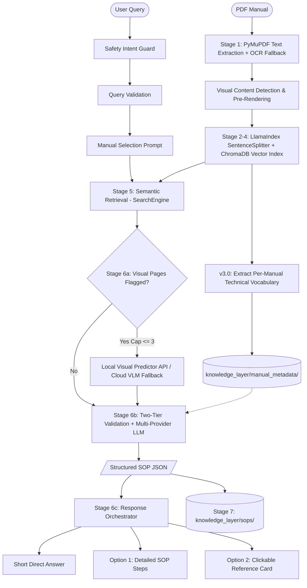

# ParseOS Manual Intelligence (v3.1)

### An AI engine that turns industrial manuals into structured, queryable procedures

> Manual Intelligence reads industrial machine manuals (PDFs) and turns them into structured, machine-readable Standard Operating Procedures (SOPs). It is the reasoning layer — the **brain** — behind the ParseOS system.


---

## The Problem

- Manufacturing, energy, and robotics run on complex machine manuals — hundreds of pages of dense PDF documentation written for human reading.
- When a motor overheats, a pump seal fails, or a PLC throws an error, technicians must manually search through binders or multi-page PDFs to locate the correct procedure.
- This manual lookup process is slow, error-prone, and unsustainable for automated plant operations.

ParseOS Manual Intelligence replaces manual search with instant, structured procedural guidance. Query *"motor overheating procedure"* and receive a validated, step-by-step SOP in machine-readable JSON — complete with risk levels, required tools, condition triggers, and safety warnings.

---

## What It Actually Is

Manual Intelligence is **not** a simple chatbot and **not** a standard document Q&A search tool. It is a **structured knowledge extraction engine** powered by a **Deferred-Vision RAG Architecture** with an **Adaptive Vocabulary System** and a **3-Part Response Orchestrator**.

The core asset produced is the **ParseOS Knowledge Layer**: a persistent library of machine-readable SOPs, each serving as an actionable unit of industrial intelligence that downstream automation systems, SCADA triggers, or technician interfaces can query.

### What's New in v3.1

- **Stage 6c — Response Orchestrator** — Every query now returns a 3-part structured response: a 2-3 sentence direct answer, an Option 1 detailed step-by-step SOP, and an Option 2 clickable manual reference card (section title + page; reference text hidden until expanded)
- **Smart Manual Selection Prompt** — In both CLI (`--query-only`) and interactive chat mode, if no `--manual` is specified, the engine does a broad scan, ranks the most relevant manuals by similarity, and prompts the user to select one before running the full pipeline. Prevents cross-manual contamination.
- **Safety Intent Guard** — Queries that attempt to bypass, disable, or override industrial safety systems (emergency stops, interlocks, LOTO, light curtains, safe torque off) are refused immediately with a standards-referenced refusal message (ISO 13849, IEC 62061).
- **Coverage Gap Analysis & Sub-Topic Decomposition** — Multi-topic queries (e.g. "electrical and mechanical safety warnings") are split into sub-topics. Each sub-topic is independently scored against retrieved evidence. Gaps are injected into the LLM prompt and surfaced in the response.
- **`--no-save` CLI Flag** — Skip Knowledge Layer JSON output for test queries without polluting the store.
- **Expanded Stop-Word Filtering (DEF-6)** — Conversational query terms (`what`, `should`, `steps`, `technician`, `correctly`, etc.) are stripped before coverage scoring to prevent natural-language queries from failing evidence checks unfairly.
- **Query Validation Hardening** — Shell command detection, unsafe-intent guard, and industrial keyword gate run in sequence before any retrieval.

### What Was New in v3.0

- **Adaptive Per-Manual Vocabulary** — Technical terms are automatically extracted during ingestion and used for intelligent evidence validation (replaces hardcoded domain vocabulary)
- **Two-Tier Validation Architecture** — Universal safety-critical terms (hard-fail) + dynamic per-manual vocabulary (coverage signal)
- **Batched Ingestion** — Large manuals (1000+ pages) are ingested in page batches to avoid ChromaDB's batch size limits
- **Reorganized Knowledge Layer** — SOP outputs and manual metadata stored in dedicated subdirectories
- **141 Industrial Manuals** — Expanded from 10 test manuals to 141 production manuals across robotics, CNC, pumps, valves, PLCs, and more

---

## How It Works (v3.1 Architecture)

ParseOS Manual Intelligence operates via a **7-stage retrieval-augmented generation (RAG) pipeline** built on LlamaIndex, enhanced with a two-tier adaptive vocabulary validation system and a 3-part response orchestrator.



### The 7 Pipeline Stages

| Stage | Name | Description | Key Modules / Tools |
|:---|:---|:---|:---|
| **1 · Extract & Detect** | **PDF Text & Visual Detection** | Extracts per-page text (with Tesseract OCR fallback for scanned pages). Applies heuristic scoring (`looks_like_table_diagram_or_formula`) to detect diagrams, tables, and schematics, pre-rendering page images to `data/page_images/`. Ingestion is **100% text-only** with zero upfront VLM calls. | PyMuPDF (`fitz`), Tesseract OCR |
| **2 · Chunk** | **Metadata-Preserving Parsing** | Splits text into overlapping nodes while propagating parent page metadata (`page_num`, `has_visual_content`, `visual_confidence`, `image_path`, `ocr_used`). | LlamaIndex `SentenceSplitter` |
| **3 · Embed** | **Vector Embedding** | Converts chunk nodes into 384-dimensional dense semantic vectors. | sentence-transformers (`all-MiniLM-L6-v2`) |
| **4 · Store** | **Vector Database Indexing** | Persists vector embeddings and metadata in a local ChromaDB collection (`manual_knowledge`). | ChromaDB (`PersistentClient`) |
| **5 · Search** | **Semantic Retrieval** | Performs cosine similarity search for relevant manual chunks, filtered by the user-selected manual. Returns structured `SearchResult` objects. | LlamaIndex `VectorStoreIndex` |
| **6a · Visual Context** | **Deferred Visual Processing** | Interrogates flagged visual pages at query time using a primary Local Visual Predictor API (`POST /predict`), falling back to Cloud VLMs. Enforces an `IMAGE_HEAVY_THRESHOLD` hard cap (max 3 images) and caches results in `data/vlm_cache/`. | Local Predictor API, Cloud VLMs |
| **6b · Reason & Validate** | **Two-Tier Evidence Validation & SOP Extraction** | **Tier 1 (Hard-fail):** Checks for `UNIVERSAL_CRITICAL` component nouns. **Tier 2 (Coverage signal):** Loads dynamic per-manual vocabulary and scores evidence overlap. Decomposes multi-part queries into sub-topics and injects coverage gap advisories into the LLM prompt. Extracts structured JSON SOP via Groq. | Groq API (`qwen/qwen3.8-27b`) |
| **6c · Orchestrate** | **3-Part Response Orchestration** | Builds a structured 3-part response: ①&nbsp;short direct answer (2-3 sentences), ②&nbsp;Option 1 full SOP with step-by-step evidence, ③&nbsp;Option 2 clickable manual reference card (section title + page number visible, reference text hidden until expanded). Falls back gracefully offline if LLM is unavailable. | `response_orchestrator.py` |
| **7 · Knowledge Layer** | **Persistence & Schema Enrichment** | Enriches SOPs with unique IDs (`KL_<manual>_<timestamp>`), query metadata, keyword triggers, overall risk evaluation, and telemetry placeholder hooks. Saves to `knowledge_layer/sops/`. Skipped when `--no-save` is active. | JSON Knowledge Store |

---

## Tech Stack

| Component | Tool / Library | Purpose |
|---|---|---|
| **Core Language** | Python 3.10+ | Primary runtime |
| **RAG Orchestration** | LlamaIndex | Document parsing, node metadata management, vector retrieval |
| **PDF Parsing** | PyMuPDF (`fitz`) | Fast PDF text and vector drawing extraction |
| **OCR Fallback** | Tesseract (`pytesseract`) | Scanned document OCR fallback |
| **Embeddings** | sentence-transformers (`all-MiniLM-L6-v2`) | Text-to-vector embedding generation |
| **Vector Store** | ChromaDB | Persistent local vector database |
| **Visual Processing (Stage 6a)** | Local Visual Predictor API (`/predict`) / Cloud VLMs | Diagram, schematic, and table transcription |
| **LLM Reasoning (Stage 6b & 6c)** | Groq (`qwen/qwen3.8-27b`) | Structured SOP extraction and response orchestration |
| **CLI & Formatting** | Colorama, argparse | Terminal UI renderer with colorized risk badges |

---

## Project Structure

```
parseos-manual-intelligence/
│
├── data/
│   ├── manuals/                   # Source PDF manuals (141 files)
│   ├── page_images/               # Pre-rendered page layout PNGs (cached during ingestion)
│   └── vlm_cache/                 # Cached visual transcription JSON outputs
│
├── src/
│   ├── __init__.py                # Package initializer
│   ├── config.py                  # Central configuration and .env manager
│   ├── pdf_parser.py              # Stage 1: Text extraction, OCR fallback, visual heuristics
│   ├── engine.py                  # Stages 2–5: LlamaIndex chunking, embeddings, ChromaDB, search
│   ├── sop_extractor.py           # Stage 6a & 6b: Visual processing, sub-topic decomposition,
│   │                              #   coverage gap analysis & multi-provider LLM extraction
│   ├── response_orchestrator.py   # Stage 6c: 3-part response orchestration (short answer,
│   │                              #   Option 1 detailed SOP, Option 2 reference card)
│   ├── knowledge_layer.py         # Stage 7: Knowledge Layer JSON storage & schema enrichment
│   ├── manual_metadata.py         # Per-manual technical vocabulary extraction & persistence
│   ├── api_retry.py               # Exponential backoff retry wrapper for API calls
│   └── chat_formatter.py          # Terminal output renderer (risk badges + orchestrated response)
│
├── tests/
│   ├── conftest.py                # Shared pytest fixtures
│   ├── test_api_retry.py          # Unit tests — API retry & backoff logic
│   ├── test_chat_formatter.py     # Unit tests — terminal output renderer
│   ├── test_config.py             # Unit tests — config & env loading
│   ├── test_engine.py             # Unit tests — ingestion & vector search engine
│   ├── test_knowledge_layer.py    # Unit tests — Knowledge Layer JSON persistence
│   ├── test_manual_metadata.py    # Unit tests — per-manual vocabulary extraction
│   ├── test_pdf_parser.py         # Unit tests — PDF text extraction & OCR fallback
│   ├── test_pipeline.py           # Integration tests — full pipeline run
│   └── test_sop_extractor.py      # Unit tests — SOP extraction, coverage gap, validation
│
├── chroma_storage/                # ChromaDB persistent vector database (~1+ GB)
│
├── knowledge_layer/
│   ├── sops/                      # Extracted SOP JSON files (KL_*.json)
│   └── manual_metadata/           # Per-manual technical vocabulary JSON files
│
├── parseos_pipeline.py            # Master CLI pipeline runner & interactive chat mode
├── ingest_all.py                  # Batch ingestion script for all manuals (with vocab extraction)
├── verify.py                      # Stage 0–7 milestone verification test suite
├── requirements.txt               # Runtime dependencies
├── requirements-test.txt          # Test-only dependencies (pytest, pytest-mock, etc.)
├── pytest.ini                     # Pytest configuration
├── pyrightconfig.json             # Pyright type checker configuration
├── ParseOS_Test_Execution_Report.md  # Latest test execution report
├── .env                           # Environment variables & API keys (not committed)
└── README.md
```

---

## Getting Started

### 1. Clone the Repository

```bash
git clone https://github.com/<your-username>/parseos-manual-intelligence.git
cd parseos-manual-intelligence
```

### 2. Set Up Virtual Environment

```bash
# Create and activate a virtual environment
python -m venv parseos_env
source parseos_env/bin/activate      # macOS / Linux
parseos_env\Scripts\activate         # Windows

# Install dependencies
pip install -r requirements.txt
```

> **Note on OCR Support:** For scanned PDF fallback support, ensure [Tesseract-OCR](https://github.com/tesseract-ocr/tesseract) is installed on your system.

---

## Configuration

Create a `.env` file in the project root to configure model providers and pipeline settings:

```bash
# ── API Provider Keys ────────────────────────────────────────────────────────
GROQ_API_KEY=your_groq_key_here
GEMINI_API_KEY=your_gemini_key_here
OPENROUTER_API_KEY=your_openrouter_key_here
OPENAI_API_KEY=your_openai_key_here

# ── Model Options ────────────────────────────────────────────────────────────
LLM_MODEL=gpt-4o
GROQ_MODEL=qwen/qwen3.8-27b
GEMINI_MODEL=gemini-2.5-flash
INGEST_VLM_MODEL=gpt-4o-mini
EMBED_MODEL=all-MiniLM-L6-v2

# ── Local Visual Predictor API Endpoint ──────────────────────────────────────
PREDICT_API_URL=http://192.168.0.128/predict

# ── Pipeline Parameters ───────────────────────────────────────────────────────
CHUNK_SIZE=400
CHUNK_OVERLAP=50
TOP_K_RESULTS=3
IMAGE_HEAVY_THRESHOLD=3

# ── Sub-Topic Coverage Gap Thresholds ────────────────────────────────────────
# coverage < NOT_FOUND  → "not_found"   | NOT_FOUND ≤ coverage < PARTIAL → "partial"
SUBTOPIC_NOT_FOUND_THRESHOLD=0.20
SUBTOPIC_PARTIAL_THRESHOLD=0.50
```

### LLM Provider for Stage 6b & 6c:

The active LLM provider is **Groq** (`qwen/qwen3.8-27b`) via an OpenAI-compatible endpoint. Visual processing (Stage 6a) uses the local `/predict` API exclusively — no cloud VLM API calls are made.

---

## Usage

### 1. Master Pipeline CLI (`parseos_pipeline.py`)

Run the complete pipeline for a single manual PDF and query:

```bash
python parseos_pipeline.py \
  --manual "data/manuals/TECO Westinghouse Motor.pdf" \
  --query "motor overheating procedure" \
  --category manufacturing
```

#### All CLI Flags:

| Flag | Description |
|---|---|
| `--manual <path>` | Path to source PDF, or name of an already-indexed manual to filter by |
| `--query <text>` | Query string for procedure extraction |
| `--category <name>` | Machine category classification (default: `general`) |
| `--ingest-only` | Run ingestion (Stages 1–4) only, no query |
| `--query-only` | Run query & extraction (Stages 5–7) only against existing index |
| `--force` | Force re-ingest manual even if already stored in ChromaDB |
| `--no-save` | Execute query without writing Knowledge Layer JSON output |
| `--chat` | Launch interactive CLI chat mode |

#### Other Pipeline Modes:

```bash
# Ingest manual only (Stages 1–4)
python parseos_pipeline.py --manual "data/manuals/TECO Westinghouse Motor.pdf" --ingest-only

# Query pre-ingested database — will prompt you to select a manual
python parseos_pipeline.py --query "motor bearing overheating maintenance" --query-only

# Query a specific pre-ingested manual directly (skips selection prompt)
python parseos_pipeline.py --manual "TECO Westinghouse Motor" --query "motor bearing overheating" --query-only

# Run a test query without saving the result to the knowledge layer
python parseos_pipeline.py --query "compressor startup sequence" --query-only --no-save

# Force re-ingestion of manual
python parseos_pipeline.py --manual "data/manuals/TECO Westinghouse Motor.pdf" --force

# Launch interactive CLI Chat Mode
python parseos_pipeline.py --chat
```

---

### 2. Manual Selection Prompt

When you run a query **without specifying a `--manual`**, ParseOS automatically does a broad scan across all ingested manuals, ranks them by relevance to your query, and asks you to select:

```
  [ParseOS] Multiple manuals may contain relevant information for this query.
  Please select the manual you want to search:

    1. O&M_manual_56-449T_frames
    2. G15L-G22-Manual
    3. Search ALL manuals

  Enter a number (1-3): _
```

- Selecting a numbered manual scopes retrieval to that document only, producing a more precise SOP.
- Selecting **Search ALL manuals** runs retrieval across the entire knowledge base.
- If only one manual matched the broad scan, it is **auto-selected** with a confirmation message.

This prompt appears in both `--query-only` CLI mode and interactive `--chat` mode.

---

### 3. Interactive CLI Chat Mode

Launch an interactive prompt to query ingested manuals dynamically:

```bash
python parseos_pipeline.py --chat
```

Inside Chat Mode:
- Type your question directly: `motor overheating procedure`
- The manual selection prompt appears automatically when no manual is pinned
- Manually pin a target manual for all subsequent queries: `use TECO Westinghouse Motor`
- Reset manual filter (back to all manuals): `use all`
- Exit chat mode: `quit` or `exit`

---

### 4. Batch Ingestion (`ingest_all.py`)

Ingest every PDF located in `data/manuals/` in a single run:

```bash
# Ingest all manuals (skips already-stored ones)
python ingest_all.py

# Force re-ingestion of all manuals
python ingest_all.py --force

# Generate/refresh vocabulary for already-ingested manuals (no re-ingestion)
python ingest_all.py --build-vocab

# Full re-ingest + rebuild vocabulary
python ingest_all.py --force --build-vocab

# Verbose output for debugging
python ingest_all.py --verbose
```

> **Large Manuals:** Documents with 1000+ pages are automatically batched in groups of 100 pages to stay within ChromaDB's batch size limits.

---

### 5. Verification Test Suite (`verify.py`)

Run the automated milestone verification suite to validate all 7 stages:

```bash
python verify.py
```

---

## Input Validation & Safety Guards

All queries pass through three sequential guards before retrieval begins:

### Guard 1 — Safety Intent Refusal
Queries that attempt to **bypass, disable, override, or circumvent industrial safety systems** are refused immediately. No retrieval or LLM generation is performed.

```
[ParseOS SAFETY REFUSAL]
This system cannot provide instructions to 'bypass' a 'safety interlock'.
Bypassing or disabling industrial safety systems is UNSAFE and contrary to
ISO 13849, IEC 62061, and machine-specific safety standards.
```

Covered safety nouns include: emergency stop, e-stop, interlock, safety relay, safety circuit, LOTO, lockout/tagout, light curtain, safe torque off (STO), door interlock, safeguard, and more.

### Guard 2 — Industrial Query Validation
Queries must contain at least one recognized **industrial equipment term** or **model code**. This filters:
- Shell/CLI commands (`git`, `ls`, `python`, `pip`, …)
- Single-word or symbol-only inputs
- Purely conversational phrases with no technical content

### Guard 3 — Manual Selection Prompt
When no target manual is specified, a ranked selection prompt surfaces the most relevant manuals before any full retrieval pipeline run (see [Manual Selection Prompt](#2-manual-selection-prompt) above).

---

## Example Output

### 3-Part Orchestrated Response (Stage 6c)

```
======================================================================
ParseOS Response
Query: motor bearing overheating maintenance
======================================================================

▶  Direct Answer:
   If the bearing temperature rises above 203 °F (95 °C), shut the motor
   down immediately to prevent severe damage and fire risk. After shutdown,
   investigate any abnormal noise or vibration and avoid touching hot motor
   parts, as they can cause burns.

Option 1 — Explain in Detail:
----------------------------------------------------------------------
Procedure: Motor Bearing Overheating Maintenance
Machine:   56-449T Frame Motor
Duration:  15-30 minutes

Step 1: [Page 19] Monitor Bearing temperature using detectors
   When:      Continuously during operation
   Tool:      Permanent or temporary temperature detector
   Risk:      LOW
   Evidence:  "By permanent detector: 212°F (100ºC); By temporary detector..."

Step 2: [Page 19] Shut down Motor
   When:      If total bearing temperature exceeds 203°F (95ºC)
   Risk:      HIGH
   Evidence:  "If the total bearing temperature exceeds 203°F (95ºC), the motor
               should be shut down immediately."
...

Safety Warnings:
  ⚠  Any abnormal noise or vibration should be immediately investigated.
  ⚠  High temperature may arise on motor surfaces; touching should be avoided.

Coverage Gaps:
  [NOT_FOUND] Lubrication inspection and replenishment for sleeve bearings
           The manual discusses temperature limits but does not provide a
           specific procedure for checking or replenishing bearing lubrication.

Option 2 — Reference to Actual Document:
  ┌────────────────────────────────────────────────────┐
  │  📄  Manual Reference                               │
  │      Page 19 — O&M_manual_56-449T_frames          │
  │────────────────────────────────────────────────────│
  │  "(4) If the total bearing temperature exceeds      │
  │  203°F (95ºC), the motor should be shut down        │
  │  immediately. ..."                                  │
  └────────────────────────────────────────────────────┘

======================================================================
```

### Knowledge Layer JSON (`knowledge_layer/sops/KL_*.json`)

```json
{
  "knowledge_id": "KL_o_m_manual_56_449t_frames_20260911_115151_833",
  "source_manual": "O&M_manual_56-449T_frames",
  "machine_category": "general",
  "query_context": "motor bearing overheating maintenance",
  "trigger_keywords": ["motor", "bearing", "overheating", "maintenance"],
  "overall_risk_level": "high",
  "telemetry_triggers": [
    {
      "signal": "placeholder_signal",
      "threshold": "placeholder_threshold",
      "status": "unlinked_project3"
    }
  ],
  "created_at": "2026-09-11T11:51:51.833000",
  "sop": {
    "procedure_title": "Motor Bearing Overheating Maintenance",
    "machine_type": "56-449T Frame Motor",
    "estimated_duration": "15-30 minutes",
    "steps": [
      {
        "step_number": 1,
        "action": "Monitor",
        "object": "Bearing temperature using detectors",
        "condition": "Continuously during operation",
        "risk_level": "low",
        "required_tool": "Temperature detector",
        "source_page": 19,
        "evidence": "By permanent detector: 212°F (100ºC)..."
      }
    ],
    "safety_warnings": [
      "Any abnormal noise or vibration should be immediately investigated and corrected."
    ],
    "coverage_gaps": [
      {
        "topic": "Lubrication inspection and replenishment for sleeve bearings",
        "status": "not_found",
        "searched_pages": [19, 27],
        "note": "The manual discusses temperature limits but does not provide a specific lubrication procedure."
      }
    ]
  }
}
```

---

## Evidence Validation Architecture

Stage 6b applies a **three-tier evidence validation** system before generating any SOP:

| Tier | Name | Behaviour |
|---|---|---|
| **Tier 0** | Stop-word & conversational-term filtering | Strips structural query words (`what`, `should`, `steps`, `technician`, etc.) before any term matching. Prevents natural-language queries from failing coverage. |
| **Tier 1** | `UNIVERSAL_CRITICAL` — Hard-fail | Cross-domain physical component nouns (`bearing`, `spindle`, `pump`, `valve`, `seal`, `shaft`, …). If any appear in the query but are absent from retrieved evidence, the query is immediately rejected as `INSUFFICIENT_EVIDENCE`. |
| **Tier 2** | Per-manual dynamic vocabulary — Coverage signal | Dynamically extracted terms from each manual (e.g. `airend`, `aftercooler` for Atlas Copco manuals). A low coverage score reduces confidence but **never** triggers a hard-fail on its own. |
| **Tier 3** | `PRESENTATION_TERMS` + `ACTION_TERMS` — Soft-exclude | Words like `diagram`, `figure`, `startup`, `check` are excluded from coverage scoring but do not block execution. Manual-vocab terms are protected from this exclusion. |

**Soft-fail rule:** A query is only rejected when **both** coverage < 0.35 **and** a critical term is missing. Low coverage alone (from conversational phrasing) does not block the pipeline.

### Sub-Topic Decomposition & Coverage Gap Analysis

Multi-topic queries are automatically decomposed into sub-topics using conjunction detection:

```
"electrical and mechanical safety warnings"
  → sub-topic 1: "electrical safety warnings"
  → sub-topic 2: "mechanical safety warnings"
```

Each sub-topic is scored independently. Gaps are injected into the LLM prompt so the model is instructed **not** to fabricate steps for unsupported topics, and to explicitly list them in `coverage_gaps`.

---

## Supported Manuals

ParseOS Manual Intelligence is production-tested against **141 industrial manuals** across multiple sectors:

<details>
<summary>View supported industrial domains (141 manuals)</summary>

| Domain | Example Manuals | Count |
|---|---|---|
| **Robotics & Assembly** | ABB IRB 120/2600/6700/1200, Universal Robots UR5/UR5e/UR12e, Fanuc R-30iB, Dobot VX500 | 25+ |
| **CNC & Manufacturing** | Haas Mill (VF-2, NGC), English Mill Interactive Manual | 10+ |
| **Process Control & Valves** | Fisher EZ Easy-E, GX Control Valve, Spence K1/K4/K5/K6, Bettis ECAT, Yarway 7100 | 20+ |
| **Pumps & Compressors** | Grundfos CR-CRN, Atlas Copco GA-30 (G15L-G22), Industrial Pump | 5+ |
| **PLCs & Industrial Automation** | Siemens S7-1200/S7-1500, ET200SP/ET200eco, SIMOTION, Fail-Safe Modules | 15+ |
| **Instrumentation & Analyzers** | Rosemount CT5400, Yokogawa IM series, BINOS 100 Series | 10+ |
| **Aerospace & Systems Engineering** | NASA Systems Engineering Handbook, FAA Handbooks (PHAK), SE Guidebook | 15+ |
| **Infrastructure & Construction** | EM 385-1-1 Safety Manual, EM 1110-2-2901, FAA 150-5380-6C | 10+ |
| **General Industrial** | ATV600 Programming Manual, FlexiBowl User Guide, Compressed Air Manual | 30+ |

Place PDF manuals into `data/manuals/` before running ingestion.

</details>

---

## Limitations

- **Scanned Documents**: Require Tesseract OCR installed on the system host.
- **Visual Page Cap**: Stage 6a limits visual page processing per query (`IMAGE_HEAVY_THRESHOLD`, default: 3) to prevent excessive processing overhead.
- **API Rate Limits**: Stage 6b and 6c rely exclusively on Groq. If Groq is unavailable, an offline fallback generates a basic SOP from retrieved text chunks.
- **ChromaDB Batch Limits**: Documents over ~700 pages may produce chunks exceeding ChromaDB's 5461 batch limit. This is handled automatically via batched ingestion (100 pages per batch).
- **Manual Selection in `--query-only`**: The manual selection prompt is interactive and requires terminal input. Non-interactive pipelines (e.g. CI) should always pass `--manual` explicitly to skip the prompt.

---

## License

*TBD* (MIT recommended for open prototype release).