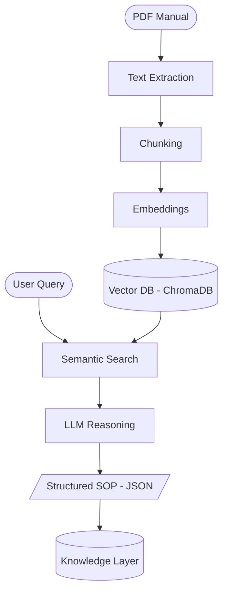
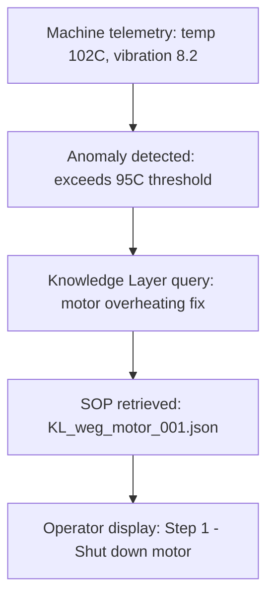

<!--
  TODO before publishing:
    - Replace <your-username> in the clone URL with the real GitHub org/user.
    - Choose a license and add a LICENSE file (MIT recommended for an open prototype).
-->

# ParseOS Manual Intelligence

### The industrial knowledge engine for ParseOS

> Manual Intelligence reads industrial machine manuals (PDFs) and turns them into structured, machine-readable Standard Operating Procedures (SOPs). It is the reasoning layer — the **brain** — of the ParseOS platform.


---

## The problem

- Manufacturing, energy, and robotics run on machine manuals — hundreds of pages of dense PDF written for humans.
- When a motor overheats or a pump seal fails, an engineer digs through a binder to find the right procedure.
- It is slow, error-prone, and does not scale.

Manual Intelligence replaces that manual search with instant, structured guidance. Ask *"motor overheating procedure?"* and get back a clean, step-by-step SOP in JSON — with actions, risk levels, required tools, and safety warnings.

---

## What it actually is

Manual Intelligence is **not** a chatbot and **not** a document search tool. It is a **structured knowledge extraction engine**.

The real asset it produces is the **Knowledge Layer**: a growing library of machine-readable SOPs, each one a unit of industrial intelligence that downstream systems can query.

---

## How it works

Manual Intelligence is a retrieval-augmented generation (RAG) pipeline. A manual goes in; structured, queryable knowledge comes out.



### The pipeline, stage by stage

| Stage | What it does | Tool |
|:------|:-------------|:-----|
| **1 · Extract** | Pull raw text from every page of the manual | PyMuPDF |
| **2 · Chunk** | Split text into overlapping, meaning-sized pieces | Custom splitter |
| **3 · Embed** | Convert each chunk into a 384-dim vector | sentence-transformers |
| **4 · Store** | Index vectors for semantic search | ChromaDB |
| **5 · Search** | Retrieve the most relevant manual sections for a query | ChromaDB query |
| **6 · Reason** | An LLM extracts structured SOP steps from those sections | OpenAI / Claude |
| **7 · Knowledge Layer** | Enrich and persist each SOP with metadata | JSON store |

---

## Tech stack

| Component | Tool / Library | Purpose |
|-----------|----------------|---------|
| Language | Python 3.10+ | Core of every component |
| PDF parsing | PyMuPDF (`fitz`) | Extract raw text from each page |
| Text chunking | Custom Python | Split text into meaningful pieces |
| Embeddings | sentence-transformers (`all-MiniLM-L6-v2`) | Text → semantic vectors |
| Vector database | ChromaDB | Store and search vectors by similarity |
| LLM reasoning | OpenAI GPT-4 **or** Anthropic Claude | Extract structured SOP steps |
| API layer | FastAPI *(planned)* | Serve the engine as a web API |
| Frontend | React.js *(planned)* | Upload manuals and run queries |
| Data format | JSON | Output format for every SOP |

> **Provider-agnostic LLM.** The reasoning stage runs on **either OpenAI GPT-4 or Anthropic Claude**. Pick the provider in your `.env` (`LLM_PROVIDER`) — no code changes needed. See [Configuration](#configuration).

---

## Project structure

```
parseos-manual-intelligence/
│
├── data/
│   └── manuals/                 # Store all source PDF manuals here
│       ├── weg_motor_manual.pdf
│       └── ...
│
├── src/
│   ├── pdf_parser.py            # Stage 1: Text extraction
│   ├── chunker.py               # Stage 2: Text chunking
│   ├── embedding_engine.py      # Stage 3: Generate embeddings
│   ├── vector_store.py          # Stage 4: ChromaDB operations
│   ├── search_engine.py         # Stage 5: Semantic search
│   ├── sop_extractor.py         # Stage 6: LLM SOP extraction
│   └── knowledge_layer.py       # Stage 7: Knowledge storage
│
├── chroma_storage/              # Auto-created by ChromaDB
├── knowledge_layer/             # Auto-created: JSON SOP files
│
├── parseos_pipeline.py          # Master runner (full pipeline)
├── requirements.txt             # All dependencies
├── .env                         # API keys (never commit)
├── .gitignore
└── README.md
```

---

## Getting started

### 1. Clone the repository

```bash
git clone https://github.com/<your-username>/parseos-manual-intelligence.git
cd parseos-manual-intelligence
```

### 2. Set up the environment

```bash
# Create and activate a virtual environment
python -m venv parseos_env
source parseos_env/bin/activate      # macOS / Linux
parseos_env\Scripts\activate         # Windows

# Install dependencies
pip install -r requirements.txt
```

No `requirements.txt` yet? Install directly:

```bash
pip install pymupdf sentence-transformers chromadb fastapi uvicorn langchain
pip install openai        # if using OpenAI
pip install anthropic     # if using Claude
```

### 3. Configure your provider and key

Create a `.env` file in the project root:

```bash
# Choose the LLM provider: "openai" or "claude"
LLM_PROVIDER=claude

# Provide the key for whichever provider you use
OPENAI_API_KEY=your_key_here
ANTHROPIC_API_KEY=your_key_here
```

> The embedding model (`all-MiniLM-L6-v2`, ~90MB) downloads automatically on first run.

### 4. Add manuals

Drop your industrial manual PDFs into `data/manuals/`. See [Supported manuals](#supported-manuals) for a starter set.

---

## Configuration

Set these in your `.env` (or as environment variables):

| Variable | Default | Description |
|----------|---------|-------------|
| `LLM_PROVIDER` | `claude` | `openai` or `claude` |
| `OPENAI_API_KEY` | — | Required if provider is `openai` |
| `ANTHROPIC_API_KEY` | — | Required if provider is `claude` |
| `CHUNK_SIZE` | `400` | Words per chunk |
| `CHUNK_OVERLAP` | `50` | Overlapping words between chunks |
| `TOP_K_RESULTS` | `3` | Number of search results retrieved |
| `EMBED_MODEL` | `all-MiniLM-L6-v2` | sentence-transformers model |

---

## Usage

Run the full pipeline on any manual, from PDF to Knowledge Layer, in a single command:

```bash
python parseos_pipeline.py \
  --manual data/manuals/weg_motor_manual.pdf \
  --query "motor bearing overheating maintenance" \
  --category manufacturing
```

The runner walks through all stages and prints the final structured SOP (example):

```
[1/7] Extracting text from: data/manuals/weg_motor_manual.pdf
[2/7] Chunking text...
[3+4/7] Embedding and storing N chunks...
[5/7] Searching for: motor bearing overheating maintenance
[6/7] Extracting SOP with LLM...
[7/7] Saving to Knowledge Layer...

=== COMPLETE ===
```

**Ingest all manuals (batch).** The runner processes one manual per call. To ingest a folder, loop over it:

```bash
for pdf in data/manuals/*.pdf; do
  python parseos_pipeline.py --manual "$pdf" --query "maintenance procedure" --category manufacturing
done
```

---

## Example output

A query like *"motor bearing overheating maintenance"* returns a structured SOP (illustrative example):

```json
{
  "procedure_title": "Motor Bearing Maintenance Procedure",
  "machine_type": "Three Phase Induction Motor",
  "steps": [
    {
      "step_number": 1,
      "action": "Shut down",
      "object": "motor power supply",
      "condition": "before any maintenance",
      "risk_level": "high",
      "required_tool": "voltage tester"
    },
    {
      "step_number": 2,
      "action": "Inspect",
      "object": "cooling fan and ventilation openings",
      "condition": "check for blockage or damage",
      "risk_level": "medium",
      "required_tool": null
    }
  ],
  "safety_warnings": [
    "Ensure power is completely off",
    "Use insulated gloves"
  ],
  "estimated_duration": "30-60 minutes"
}
```

In the Knowledge Layer, each SOP is enriched further with a unique ID, source manual, normalized machine type, industry category, trigger keywords, overall risk level, and `telemetry_triggers` — the hook that lets future systems connect live machine signals to the right procedure.

---

## Where it fits in ParseOS

Manual Intelligence is the first of three layers in the ParseOS vision. It is the foundation everything else connects to.

| Layer | Component | Role |
|-------|-----------|------|
| **Brain** | **Manual Intelligence** (this repo) | Manuals → structured knowledge |
| **Eyes** | Project 3 | Telemetry → anomaly detection |
| **Hands** | ParseOS | Assisted execution guidance |

Once the Knowledge Layer is populated, telemetry-driven systems can close the loop automatically:



This is why every field in the Knowledge Layer schema matters — the `telemetry_triggers` field is the bridge to that next layer.

---

## Supported manuals

Manual Intelligence is designed to work with ten real, publicly available industrial manuals across six industrial sectors.

<details>
<summary>View the full manual list</summary>

| # | Manual | Industry | Device |
|---|--------|----------|--------|
| 1 | WEG W22 Electric Motor | Manufacturing | Electric Motor |
| 2 | TECO Westinghouse Motor | Manufacturing | 3-Phase Motor |
| 3 | Piggott Wind Turbine | Energy & Utilities | Small Wind Turbine |
| 4 | WES80 Wind Turbine | Energy & Utilities | Medium Wind Turbine |
| 5 | DOE Pump Sourcebook | Equipment Maintenance | Industrial Pumps |
| 6 | USFS Hand Pump Manual | Equipment Maintenance | Hand Pump |
| 7 | Universal Robots UR5 | Robotics & Assembly | Collaborative Robot |
| 8 | Fanuc CNC 30i | Robotics & Assembly | CNC Machine |
| 9 | NASA MOD-2 Turbine | Aerospace | Wind/Energy System |
| 10 | Siemens S7-1200 PLC | Industrial Control | PLC Controller |

All manuals are publicly available from their respective manufacturers, government sources, or public archives. They are **not** redistributed in this repo — download them into `data/manuals/`.

</details>

---

## Limitations

- **Scanned-image PDFs** return empty text — they need OCR (`pip install pytesseract`) before extraction works.
- **FastAPI service** and **React UI** are planned, not yet implemented.
- The runner processes **one manual per call** — use the batch loop above to ingest many.

---

## Contributing

Contributions are welcome. The pipeline is intentionally modular — each stage lives in its own file under `src/` with a clear input, output, and test case.

1. Fork the repository and create a feature branch.
2. Keep each module's contract clean: one clear input, one clear output, one test.
3. Open a pull request describing what you changed and why.

A guiding principle from the project philosophy: **never commit code you do not understand.** Understand first, then build.

---

## License

_Not yet chosen._ Pick a license before the public release — MIT is a common default for an open prototype. Once decided, add a `LICENSE` file to the repo root.

---

<sub>ParseOS · Manual Intelligence — building the brain first. Everything else connects to it later.</sub>
