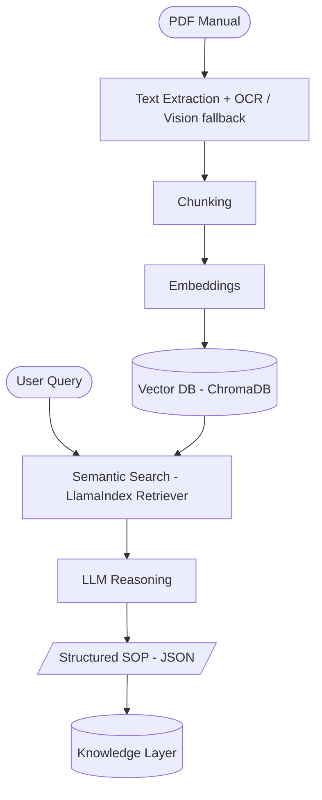

--------------------------------------------------------------------------
<!--
  TODO before publishing:
    - Replace <your-username> in the clone URL with the real GitHub org/user.
    - Choose a license and add a LICENSE file (MIT recommended for an open prototype).
-->

# ParseOS Manual Intelligence

### An AI engine that turns industrial manuals into structured, queryable procedures

> Manual Intelligence reads industrial machine manuals (PDFs) and turns them into structured, machine-readable Standard Operating Procedures (SOPs). It is the reasoning layer — the **brain** — behind this system.


---

## The problem

- Manufacturing, energy, and robotics run on machine manuals — hundreds of pages of dense PDF written for humans.
- When a motor overheats or a pump seal fails, an engineer digs through a binder to find the right procedure.
- It is slow, error-prone, and does not scale.

Manual Intelligence replaces that manual search with instant, structured guidance. Ask *"motor overheating procedure?"* and get back a clean, step-by-step SOP in JSON — with actions, risk levels, required tools, and safety warnings.

---

## What it actually is

Manual Intelligence is **not** a chatbot and **not** a plain document search tool. It is a **structured knowledge extraction engine**.

The real asset it produces is the **Knowledge Layer**: a growing library of machine-readable SOPs, each one a unit of industrial intelligence that downstream systems can query.

---

## How it works

Manual Intelligence is a retrieval-augmented generation (RAG) pipeline, built on LlamaIndex. A manual goes in; structured, queryable knowledge comes out.



### The pipeline, stage by stage

| Stage | What it does | Tool |
|:------|:-------------|:-----|
| **1 · Extract** | Pull text from every page; pages with diagrams/tables/formulas go through a vision model, scanned pages fall back to OCR | PyMuPDF, Gemini Vision, Tesseract OCR |
| **2 · Chunk** | Split text into overlapping, meaning-sized pieces | LlamaIndex `SentenceSplitter` |
| **3 · Embed** | Convert each chunk into a 384-dim vector | sentence-transformers (`all-MiniLM-L6-v2`) |
| **4 · Store** | Index vectors for semantic search | ChromaDB (local persistent) |
| **5 · Search** | Retrieve the most relevant manual sections for a query | LlamaIndex `VectorIndexRetriever` |
| **6 · Reason** | An LLM extracts structured SOP steps from those sections (with the page image attached when a formula, table, or diagram is involved) | OpenAI GPT-4o / Google Gemini / OpenRouter |
| **7 · Knowledge Layer** | Enrich and persist each SOP with metadata | JSON store |

---

## Tech stack

| Component | Tool / Library | Purpose |
|-----------|----------------|---------|
| Language | Python 3.10+ | Core of every component |
| PDF parsing | PyMuPDF (`fitz`) | Extract raw text from each page |
| Vision fallback | Gemini Vision (or configured VLM) | Transcribe diagrams, formulas, and tables from page images |
| OCR fallback | Tesseract (`pytesseract`) | Extract text from scanned pages that have no selectable text |
| Text chunking | LlamaIndex `SentenceSplitter` | Split text into meaningful pieces |
| Embeddings | sentence-transformers (`all-MiniLM-L6-v2`) | Text → semantic vectors |
| Vector database | ChromaDB | Store and search vectors by similarity |
| LLM reasoning | OpenAI GPT-4o, Google Gemini, or OpenRouter | Extract structured SOP steps |
| API layer | FastAPI *(planned)* | Serve the engine as a web API |
| Frontend | React.js *(planned)* | Upload manuals and run queries |
| Data format | JSON | Output format for every SOP |


---

## Project structure

```
parseos-manual-intelligence/
│
├── data/
│   └── manuals/                 # Store all source PDF manuals here
│       ├── weg_motor_manual.pdf
│       └── ...
│
├── src/
│   ├── config.py                 # Central config, loads .env
│   ├── pdf_parser.py             # Stage 1: Text extraction (+ OCR / Vision fallback)
│   ├── engine.py                 # Stages 2-5: Chunking, embeddings, ChromaDB, search (LlamaIndex)
│   ├── sop_extractor.py          # Stage 6: LLM SOP extraction
│   ├── knowledge_layer.py        # Stage 7: Knowledge storage
│   ├── api_retry.py              # Retry/backoff helper for API calls
│   └── chat_formatter.py         # Formats SOP output for the interactive chat mode
│
├── chroma_storage/               # Auto-created by ChromaDB
├── knowledge_layer/               # Auto-created: JSON SOP files
│
├── parseos_pipeline.py            # Master runner (CLI + interactive chat mode)
├── ingest_all.py                  # Batch-ingest every PDF in data/manuals/
├── verify.py                      # Milestone verification, stage by stage
├── requirements.txt                # All dependencies
├── .env                            # API keys (never commit)
├── .gitignore
└── README.md
```

---

## Getting started

### 1. Clone the repository

```bash
git clone https://github.com/<your-username>/parseos-manual-intelligence.git
cd parseos-manual-intelligence
```

### 2. Set up the environment

```bash
# Create and activate a virtual environment
python -m venv parseos_env
source parseos_env/bin/activate      # macOS / Linux
parseos_env\Scripts\activate         # Windows

# Install dependencies
pip install -r requirements.txt
```

> To enable OCR fallback for scanned pages, also install `pytesseract` and `Pillow`, and have the Tesseract-OCR binary available on your system.

### 3. Configure your provider and key

Create a `.env` file in the project root:

```bash
# Provide at least one key — checked in this order: Gemini, then OpenRouter, then OpenAI
GEMINI_API_KEY=your_key_here
OPENROUTER_API_KEY=your_key_here
OPENAI_API_KEY=your_key_here
```

> The embedding model (`all-MiniLM-L6-v2`, ~90MB) downloads automatically on first run.

### 4. Add manuals

Drop your industrial manual PDFs into `data/manuals/`. See [Supported manuals](#supported-manuals) for a starter set.

---

## Configuration

Set these in your `.env` (or as environment variables):

| Variable | Default | Description |
|----------|---------|-------------|
| `GEMINI_API_KEY` | — | Checked first for Stage 6 LLM extraction |
| `OPENROUTER_API_KEY` | — | Checked second |
| `OPENAI_API_KEY` | — | Checked third |
| `LLM_MODEL` | `gpt-4o` | Model used for SOP extraction |
| `INGEST_VLM_MODEL` | `gpt-4o-mini` | Vision model used to transcribe diagrams/tables/formulas at ingest time |
| `USE_LAYOUT_PARSER` | `True` | Enables the vision-based page transcription during ingestion |
| `CHUNK_SIZE` | `400` | Words per chunk |
| `CHUNK_OVERLAP` | `50` | Overlapping words between chunks |
| `TOP_K_RESULTS` | `3` | Number of search results retrieved |
| `EMBED_MODEL` | `all-MiniLM-L6-v2` | sentence-transformers model |
| `IMAGE_HEAVY_THRESHOLD` | `4` | Max page images sent to the vision model in a single query |

---

## Usage

Run the full pipeline on a single manual, from PDF to Knowledge Layer:

```bash
python parseos_pipeline.py \
  --manual data/manuals/weg_motor_manual.pdf \
  --query "motor bearing overheating maintenance" \
  --category manufacturing
```

The runner prints progress in two blocks and then the final structured SOP:

```
──────────────────────────────────────────────
  INGESTION PIPELINE (Stages 1–4)
──────────────────────────────────────────────
[1/1] Ingesting manual via LlamaIndex IngestionPipeline …

──────────────────────────────────────────────
  QUERY PIPELINE (Stages 5–7)
──────────────────────────────────────────────
[1/3] Semantic search (LlamaIndex): '...'
[2/3] Extracting SOP with LlamaIndex LLM (...)
[3/3] Saving to Knowledge Layer …
```

Other useful modes:

```bash
# Ingest only (stages 1-4, no LLM call)
python parseos_pipeline.py --manual data/manuals/weg_motor_manual.pdf --ingest-only

# Query only, manual already ingested (stages 5-7)
python parseos_pipeline.py --query "motor overheating fix" --category manufacturing --query-only

# Interactive chat mode
python parseos_pipeline.py --chat
```

**Batch ingestion.** To ingest every PDF in `data/manuals/` in one go:

```bash
python ingest_all.py
python ingest_all.py --force   # re-ingest even if already stored
```

---

## Example output

A query like *"motor bearing overheating maintenance"* returns a structured SOP (illustrative example):

```json
{
  "procedure_title": "Motor Bearing Maintenance Procedure",
  "machine_type": "Three Phase Induction Motor",
  "steps": [
    {
      "step_number": 1,
      "action": "Shut down",
      "object": "motor power supply",
      "condition": "before any maintenance",
      "risk_level": "high",
      "required_tool": "voltage tester"
    },
    {
      "step_number": 2,
      "action": "Inspect",
      "object": "cooling fan and ventilation openings",
      "condition": "check for blockage or damage",
      "risk_level": "medium",
      "required_tool": null
    }
  ],
  "safety_warnings": [
    "Ensure power is completely off",
    "Use insulated gloves"
  ],
  "estimated_duration": "30-60 minutes"
}
```

In the Knowledge Layer, each SOP is enriched further with a unique ID, source manual, industry category, trigger keywords, overall risk level, and a `telemetry_triggers` placeholder field for future use.

---

## Supported manuals

Manual Intelligence is designed to work with ten real, publicly available industrial manuals across many industrial sectors.

<details>
<summary>View the full manual list</summary>

| # | Manual | Industry | Device |
|---|--------|----------|--------|
| 1 | ABB IRB 120 | Robotics & Assembly | Industrial Robot |
| 2 | Atlas Copco Compressed Air | Equipment Maintenance | Compressed Air System |
| 3 | Fisher EZ Easy-E Control Valve | Process Control | Control Valve |
| 4 | Grundfos CR-CRN Multistage Pump | Equipment Maintenance | Multistage Centrifugal Pump |
| 5 | Haas Mill | Manufacturing | CNC Milling Machine |
| 6 | Maintenance Manual v3.2.1 | Equipment Maintenance | Industrial Equipment |
| 7 | TECO Westinghouse Motor | Manufacturing | Electric Motor |
| 8 | Industrial Pump | Equipment Maintenance | Industrial Pump |
| 9 | Siemens S7-1200 PLC | Industrial Automation | PLC Controller |
| 10 | Universal Robots UR5 | Robotics & Assembly | Collaborative Robot |

All manuals are publicly available from their respective manufacturers, government sources, or public archives. They are **not** redistributed in this repo — download them into `data/manuals/`.

</details>

---

## Limitations

- **Scanned or image-heavy pages** rely on the OCR/vision fallback, which needs `pytesseract` + the Tesseract binary installed (for OCR) and a working API key (for the vision transcription step) — without those, such pages may still return empty text.
- **FastAPI service** and **React UI** are planned, not yet implemented.
- Vision-model calls are capped per query (`IMAGE_HEAVY_THRESHOLD`) to stay within free-tier API quotas, so very diagram-heavy queries may only get partial visual context.

---

## Contributing

Contributions are welcome. The pipeline is intentionally modular — each stage lives in its own file under `src/` with a clear input, output, and test case.

1. Fork the repository and create a feature branch.
2. Keep each module's contract clean: one clear input, one clear output, one test.
3. Open a pull request describing what you changed and why.

A guiding principle from the project philosophy: **never commit code you do not understand.** Understand first, then build.

---

## License

_Not yet chosen._ Pick a license before the public release — MIT is a common default for an open prototype. Once decided, add a `LICENSE` file to the repo root.

---

<sub>Manual Intelligence — a research prototype, built stage by stage.</sub>