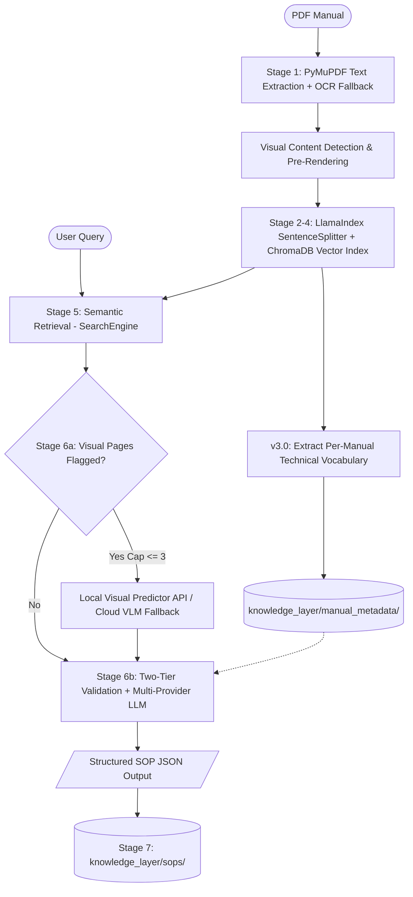

# ParseOS Manual Intelligence (v3.0)

### An AI engine that turns industrial manuals into structured, queryable procedures

> Manual Intelligence reads industrial machine manuals (PDFs) and turns them into structured, machine-readable Standard Operating Procedures (SOPs). It is the reasoning layer — the **brain** — behind the ParseOS system.


---

## The Problem

- Manufacturing, energy, and robotics run on complex machine manuals — hundreds of pages of dense PDF documentation written for human reading.
- When a motor overheats, a pump seal fails, or a PLC throws an error, technicians must manually search through binders or multi-page PDFs to locate the correct procedure.
- This manual lookup process is slow, error-prone, and unsustainable for automated plant operations.

ParseOS Manual Intelligence replaces manual search with instant, structured procedural guidance. Query *"motor overheating procedure"* and receive a validated, step-by-step SOP in machine-readable JSON — complete with risk levels, required tools, condition triggers, and safety warnings.

---

## What It Actually Is

Manual Intelligence is **not** a simple chatbot and **not** a standard document Q&A search tool. It is a **structured knowledge extraction engine** powered by a **Deferred-Vision RAG Architecture** with an **Adaptive Vocabulary System**.

The core asset produced is the **ParseOS Knowledge Layer**: a persistent library of machine-readable SOPs, each serving as an actionable unit of industrial intelligence that downstream automation systems, SCADA triggers, or technician interfaces can query.

### What's New in v3.0

- **Adaptive Per-Manual Vocabulary** — Technical terms are automatically extracted during ingestion and used for intelligent evidence validation (replaces hardcoded domain vocabulary)
- **Two-Tier Validation Architecture** — Universal safety-critical terms (hard-fail) + dynamic per-manual vocabulary (coverage signal)
- **Batched Ingestion** — Large manuals (1000+ pages) are ingested in page batches to avoid ChromaDB's batch size limits
- **Reorganized Knowledge Layer** — SOP outputs and manual metadata stored in dedicated subdirectories
- **141 Industrial Manuals** — Expanded from 10 test manuals to 141 production manuals across robotics, CNC, pumps, valves, PLCs, and more

---

## How It Works (v3.0 Architecture)

ParseOS Manual Intelligence operates via a 7-stage retrieval-augmented generation (RAG) pipeline built on LlamaIndex, enhanced with a two-tier adaptive vocabulary validation system.



### The 7 Pipeline Stages

| Stage | Name | Description | Key Modules / Tools |
|:---|:---|:---|:---|
| **1 · Extract & Detect** | **PDF Text & Visual Detection** | Extracts per-page text (with Tesseract OCR fallback for scanned pages). Applies heuristic scoring (`looks_like_table_diagram_or_formula`) to detect diagrams, tables, and schematics, pre-rendering page images to `data/page_images/`. Ingestion is **100% text-only** with zero upfront VLM calls. | PyMuPDF (`fitz`), Tesseract OCR |
| **2 · Chunk** | **Metadata-Preserving Parsing** | Splits text into overlapping nodes while propagating parent page metadata (`page_num`, `has_visual_content`, `visual_confidence`, `image_path`, `ocr_used`). | LlamaIndex `SentenceSplitter` |
| **3 · Embed** | **Vector Embedding** | Converts chunk nodes into 384-dimensional dense semantic vectors. | sentence-transformers (`all-MiniLM-L6-v2`) |
| **4 · Store** | **Vector Database Indexing** | Persists vector embeddings and metadata in a local ChromaDB collection (`manual_knowledge`). | ChromaDB (`PersistentClient`) |
| **5 · Search** | **Semantic Retrieval** | Performs cosine similarity search for relevant manual chunks, filtered optionally by specific manual target. Returns structured `SearchResult` objects. | LlamaIndex `VectorStoreIndex` |
| **6a · Visual Context** | **Deferred Visual Processing** | Interrogates flagged visual pages at query time using a primary Local Visual Predictor API (`POST /predict`), falling back to Cloud VLMs (Gemini/OpenRouter/OpenAI). Enforces an `IMAGE_HEAVY_THRESHOLD` hard cap (max 3 images) and caches results in `data/vlm_cache/`. | Local Predictor API, Gemini Vision / GPT-4o-mini |
| **6b · Reason & Validate** | **Two-Tier Evidence Validation & Multi-Provider SOP Extraction** | **Tier 1 (Hard-fail):** Checks for `UNIVERSAL_CRITICAL` component nouns (bearing, spindle, pump, valve…) — rejects immediately if a critical term is absent from evidence. **Tier 2 (Coverage signal):** Loads dynamic per-manual vocabulary from `manual_metadata.py` and scores evidence overlap — low coverage hurts scoring but does not hard-fail. Extracts structured JSON SOP via multi-provider fallback (Groq → Gemini → OpenRouter → OpenAI). | Groq (`llama-3.3-70b-versatile`), Gemini 2.0 Flash, OpenAI |
| **7 · Knowledge Layer** | **Persistence & Schema Enrichment** | Enriches SOPs with unique IDs (`KL_<manual>_<timestamp>`), query metadata, keyword triggers, overall risk evaluation, and telemetry placeholder hooks for downstream integration. Saves to `knowledge_layer/sops/`. | JSON Knowledge Store |

---

## Tech Stack

| Component | Tool / Library | Purpose |
|---|---|---|
| **Core Language** | Python 3.10+ | Primary runtime |
| **RAG Orchestration** | LlamaIndex | Document parsing, node metadata management, vector retrieval |
| **PDF Parsing** | PyMuPDF (`fitz`) | Fast PDF text and vector drawing extraction |
| **OCR Fallback** | Tesseract (`pytesseract`) | Scanned document OCR fallback |
| **Embeddings** | sentence-transformers (`all-MiniLM-L6-v2`) | Text-to-vector embedding generation |
| **Vector Store** | ChromaDB | Persistent local vector database |
| **Visual Processing (Stage 6a)** | Local Visual Predictor API (`/predict`) / Cloud VLMs | Diagram, schematic, and table transcription |
| **LLM Reasoning (Stage 6b)** | Groq, Google Gemini 2.0 Flash, OpenRouter, OpenAI GPT-4o | Structured SOP extraction |
| **CLI & Formatting** | Colorama, argparse | Terminal UI renderer with colorized risk badges |

---

## Project Structure

```
parseos-manual-intelligence/
│
├── data/
│   ├── manuals/                 # Source PDF manuals (141 files)
│   ├── page_images/             # Pre-rendered page layout PNGs (cached during ingestion)
│   └── vlm_cache/               # Cached visual transcription JSON outputs
│
├── src/
│   ├── __init__.py               # Package initializer
│   ├── config.py                 # Central configuration and .env manager
│   ├── pdf_parser.py             # Stage 1: Text extraction, OCR fallback, visual heuristics
│   ├── engine.py                 # Stages 2–5: LlamaIndex chunking, embeddings, ChromaDB, search
│   ├── sop_extractor.py          # Stage 6a & 6b: Visual processing & multi-provider LLM extraction
│   ├── knowledge_layer.py        # Stage 7: Knowledge Layer JSON storage & schema enrichment
│   ├── manual_metadata.py        # v3.0: Per-manual technical vocabulary extraction & persistence
│   ├── api_retry.py              # Exponential backoff retry wrapper for API calls
│   └── chat_formatter.py         # Terminal output renderer with risk badges
│
├── chroma_storage/               # ChromaDB persistent vector database (~1+ GB)
│
├── knowledge_layer/
│   ├── sops/                     # Extracted SOP JSON files (KL_*.json)
│   └── manual_metadata/          # Per-manual technical vocabulary JSON files
│
├── parseos_pipeline.py            # Master CLI pipeline runner & interactive chat mode
├── ingest_all.py                  # Batch ingestion script for all manuals (with vocab extraction)
├── verify.py                      # Stage 0–7 milestone verification test suite
├── requirements.txt                # Project python dependencies
├── pyrightconfig.json              # Pyright type checker configuration
├── .env                            # Environment variables & API keys configuration
└── README.md
```

---

## Getting Started

### 1. Clone the Repository

```bash
git clone https://github.com/<your-username>/parseos-manual-intelligence.git
cd parseos-manual-intelligence
```

### 2. Set Up Virtual Environment

```bash
# Create and activate a virtual environment
python -m venv parseos_env
source parseos_env/bin/activate      # macOS / Linux
parseos_env\Scripts\activate         # Windows

# Install dependencies
pip install -r requirements.txt
```

> **Note on OCR Support:** For scanned PDF fallback support, ensure [Tesseract-OCR](https://github.com/tesseract-ocr/tesseract) is installed on your system.

---

## Configuration

Create a `.env` file in the project root to configure model providers and pipeline settings:

```bash
# ── API Provider Keys (Checked in priority order for Stage 6b) ─────────────
GROQ_API_KEY=your_groq_key_here
GEMINI_API_KEY=your_gemini_key_here
OPENROUTER_API_KEY=your_openrouter_key_here
OPENAI_API_KEY=your_openai_key_here

# ── Model Options ──────────────────────────────────────────────────────────
LLM_MODEL=gpt-4o
GROQ_MODEL=llama-3.3-70b-versatile
INGEST_VLM_MODEL=gpt-4o-mini
EMBED_MODEL=all-MiniLM-L6-v2

# ── Local Visual Predictor API Endpoint ──────────────────────────────────
PREDICT_API_URL=http://192.168.0.128/predict

# ── Pipeline Parameters ──────────────────────────────────────────────────
CHUNK_SIZE=400
CHUNK_OVERLAP=50
TOP_K_RESULTS=3
IMAGE_HEAVY_THRESHOLD=3
```

### Provider Fallback Order for Stage 6b:
1. **Groq API** (`llama-3.3-70b-versatile`)
2. **Gemini API** (`gemini-2.0-flash`)
3. **OpenRouter API**
4. **OpenAI API** (`gpt-4o`)
5. **Offline Fallback** (Generates structured SOP from retrieved text chunks if all API quotas are exhausted)

---

## Usage

### 1. Master Pipeline CLI (`parseos_pipeline.py`)

Run the complete pipeline for a single manual PDF and query:

```bash
python parseos_pipeline.py \
  --manual "data/manuals/TECO Westinghouse Motor.pdf" \
  --query "motor overheating procedure" \
  --category manufacturing
```

#### Other Pipeline Modes:

```bash
# Ingest manual only (Stages 1–4)
python parseos_pipeline.py --manual "data/manuals/TECO Westinghouse Motor.pdf" --ingest-only

# Query pre-ingested database (Stages 5–7)
python parseos_pipeline.py --query "motor bearing overheating maintenance" --category manufacturing --query-only

# Force re-ingestion of manual
python parseos_pipeline.py --manual "data/manuals/TECO Westinghouse Motor.pdf" --force

# Launch interactive CLI Chat Mode
python parseos_pipeline.py --chat
```

---

### 2. Interactive CLI Chat Mode

Launch an interactive prompt to query ingested manuals dynamically:

```bash
python parseos_pipeline.py --chat
```

Inside Chat Mode:
- Type your question directly: `motor overheating procedure`
- Filter queries to a specific manual: `use TECO Westinghouse Motor`
- Reset manual filter: `use all`
- Exit chat mode: `quit` or `exit`

---

### 3. Batch Ingestion (`ingest_all.py`)

Ingest every PDF located in `data/manuals/` in a single run:

```bash
# Ingest all manuals (skips already-stored ones)
python ingest_all.py

# Force re-ingestion of all manuals
python ingest_all.py --force

# Generate/refresh vocabulary for already-ingested manuals (no re-ingestion)
python ingest_all.py --build-vocab

# Full re-ingest + rebuild vocabulary
python ingest_all.py --force --build-vocab

# Verbose output for debugging
python ingest_all.py --verbose
```

> **Large Manuals:** Documents with 1000+ pages are automatically batched in groups of 100 pages to stay within ChromaDB's batch size limits.

---

### 4. Verification Test Suite (`verify.py`)

Run the automated milestone verification suite to validate all 7 stages:

```bash
python verify.py
```

---

## Example Output

### Terminal Output (`chat_formatter.py`)

```
======================================================================
SOP: MOTOR BEARING OVERHEATING MAINTENANCE PROCEDURE
ID: KL_teco_westinghouse_motor_20260803_103000
Machine Type: Three Phase Induction Motor | Est. Duration: 30-60 minutes
======================================================================

[SAFETY WARNINGS & PRECAUTIONS]:
  * Ensure power supply is completely isolated and locked out before inspection.
  * Use proper personal protective equipment (PPE) including thermal gloves.

[PROCEDURE STEPS] (2 total):
----------------------------------------------------------------------

  Step 1: [HIGH RISK] Shut down -> motor power supply
          Condition: Immediately upon detecting bearing temperature exceeding threshold
          Tool Required: Lockout Tagout Kit / Voltage Tester

  Step 2: [MED RISK] Inspect -> bearing lubrication and cooling fan
          Condition: Allow motor casing to cool down to safe handling temperature
          Tool Required: Lubrication Gun / Thermographic Camera

======================================================================
```

### Knowledge Layer JSON (`knowledge_layer/sops/*.json`)

```json
{
  "knowledge_id": "KL_teco_westinghouse_motor_20260803_103000",
  "source_manual": "TECO Westinghouse Motor",
  "machine_category": "manufacturing",
  "query_context": "motor bearing overheating maintenance",
  "trigger_keywords": ["motor", "bearing", "overheating", "maintenance"],
  "overall_risk_level": "high",
  "telemetry_triggers": [
    {
      "signal": "placeholder_signal",
      "threshold": "placeholder_threshold",
      "status": "unlinked_project3"
    }
  ],
  "created_at": "2026-08-03T10:30:00.000000",
  "sop": {
    "procedure_title": "Motor Bearing Overheating Maintenance Procedure",
    "machine_type": "Three Phase Induction Motor",
    "steps": [
      {
        "step_number": 1,
        "action": "Shut down",
        "object": "motor power supply",
        "condition": "Immediately upon detecting bearing temperature exceeding threshold",
        "risk_level": "high",
        "required_tool": "Lockout Tagout Kit / Voltage Tester"
      }
    ],
    "safety_warnings": [
      "Ensure power supply is completely isolated and locked out before inspection."
    ],
    "estimated_duration": "30-60 minutes"
  }
}
```

---

## Supported Manuals

ParseOS Manual Intelligence is production-tested against **141 industrial manuals** across multiple sectors:

<details>
<summary>View supported industrial domains (141 manuals)</summary>

| Domain | Example Manuals | Count |
|---|---|---|
| **Robotics & Assembly** | ABB IRB 120/2600/6700/1200, Universal Robots UR5/UR5e/UR12e, Fanuc R-30iB, Dobot VX500 | 25+ |
| **CNC & Manufacturing** | Haas Mill (VF-2, NGC), English Mill Interactive Manual | 10+ |
| **Process Control & Valves** | Fisher EZ Easy-E, GX Control Valve, Spence K1/K4/K5/K6, Bettis ECAT, Yarway 7100 | 20+ |
| **Pumps & Compressors** | Grundfos CR-CRN, Atlas Copco GA-30, Industrial Pump | 5+ |
| **PLCs & Industrial Automation** | Siemens S7-1200/S7-1500, ET200SP/ET200eco, SIMOTION, Fail-Safe Modules | 15+ |
| **Instrumentation & Analyzers** | Rosemount CT5400, Yokogawa IM series, BINOS 100 Series | 10+ |
| **Aerospace & Systems Engineering** | NASA Systems Engineering Handbook, FAA Handbooks (PHAK), SE Guidebook | 15+ |
| **Infrastructure & Construction** | EM 385-1-1 Safety Manual, EM 1110-2-2901, FAA 150-5380-6C | 10+ |
| **General Industrial** | ATV600 Programming Manual, FlexiBowl User Guide, Compressed Air Manual | 30+ |

Place PDF manuals into `data/manuals/` before running ingestion.

</details>

---

## Limitations

- **Scanned Documents**: Require Tesseract OCR installed on the system host.
- **Visual Page Cap**: Stage 6a limits visual page processing per query (`IMAGE_HEAVY_THRESHOLD`, default: 3) to prevent excessive processing overhead.
- **API Rate Limits**: Handled gracefully via multi-provider fallback and offline fallback SOP generation when cloud provider quotas are fully exhausted.
- **ChromaDB Batch Limits**: Documents over ~700 pages may produce chunks exceeding ChromaDB's 5461 batch limit. This is handled automatically via batched ingestion (100 pages per batch).

---

## License

*TBD* (MIT recommended for open prototype release).